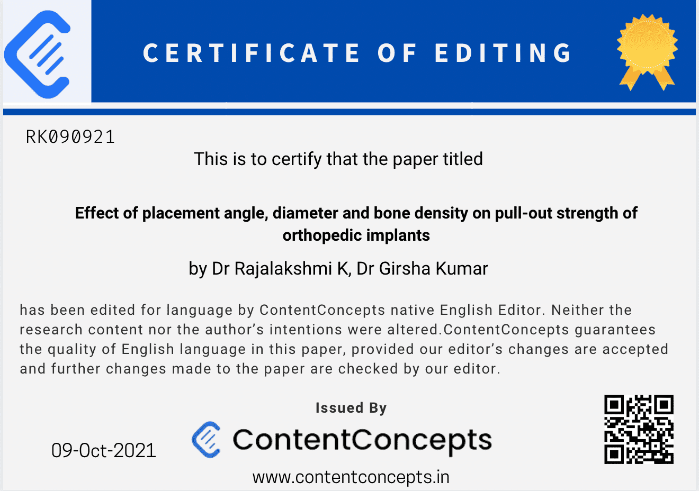

When you choose [ContentConcepts](https://contentconcepts.com/) for your [Substantive Editing Service](https://contentconcepts.com/services/academic_), you're not only investing in refined content but also receiving a valuable bonus: a complimentary English Editing Certificate. This certificate serves as a testament to the precision and expertise that goes into your manuscript.

## What is the English Editing Certificate?

Our [English Editing Certificate](https://contentconcepts.com/blog/free-english-editing-certificate) is your evidence of having a professional English language editor meticulously review and refine your academic work. ContentConcepts proudly offers this certificate as a downloadable proof of language accuracy, ensuring your document is submission-ready. We guarantee 100% language error-free papers, establishing our name as a trusted figure in academic editing and proofreading.

## What's Included in the Editing Certificate?

The Editing Certificate includes the following key details:

* Title of your paper
* Authors' names (as per the paper)
* Declaration of English language editing and guarantee by our Chief Editor
* Date of editing
* QR code for quick certificate validation

## The Importance of an Editing Certificate

An Editing Certificate holds significant value, especially for ESL authors seeking journal publication. At ContentConcepts, we offer this valuable certificate with every order, demonstrating that your document meets the highest editing standards upheld by our expert [editors](https://blog.contentconcepts.com/our-manuscript-editorsscientific-editors-proofreaders). By showcasing this certificate, you exhibit your dedication to meeting industry requisites and showcasing professionally edited content.

## Your Path to Publication

While we can't guarantee publication, an Editing Certificate adds credibility to your manuscript. Journal editors appreciate the thorough review process our certificate represents, allowing them to focus on your research's essence rather than language intricacies. Presenting our certificate alongside your article increases your paper's chances of undergoing peer review. ContentConcepts is committed to supporting your publishing endeavors – contact us today to explore our editing services and how we can elevate your manuscript.