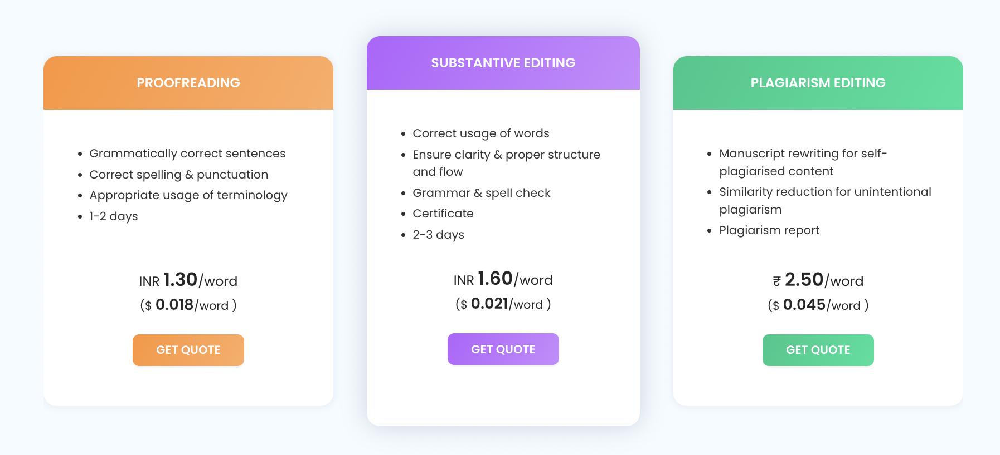
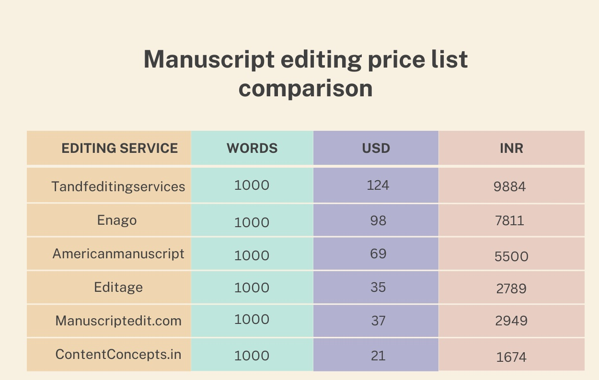

[Manuscript editing charges](https://contentconcepts.in/blog/how-much-does-manuscript-editing-cost-per-page-per-word/) vary across countries and editing service providers. Manuscript editing price is based on the location of the editing service provider, experience of the manuscript editor as well as the level of editing required.

How is the manuscript editing fee determined?

Apart from the above-mentioned reasons the following will determine the editing price of your manuscript.

1. **[Word count](https://contentconcepts.in/pricing/)** - this it the total number of editable words in your manuscript. Usually manuscript editors do not include Figures, Tables and References in the editing fee. 

   Tip - Remove the sections that you do not want to edit before sending your manuscript for quote request. 
2. **[Level of editing ](https://contentconcepts.in/pricing/#pricing)required for your manuscript** - Manuscript editing service providers define editing in different ways. Usually all the manuscript service providers offer three levels of English editing.
3. **Proofreading** - This includes checking the manuscript for grammar, spelling and consistent usage of words. No rewriting or extensive editing for language is done by the editor. If you are confident that your manuscript has good language and requires only final check for typos, then select proofreading. Else go for substantive editing service.
4. **Location of the Editing Service provider**: The manuscript editing charges are higher in the US, UK and Europe compared to India. This is because of the financial status of the western countries and their economy. 
5. **India has Native-English level editors** -  India now has Native-English level editors whose editing skill are on par with international editors. The number of English as first language people in India are far higher than some countries in the west. 

Here is the price list of top editing services in India and their manuscript editing charges

