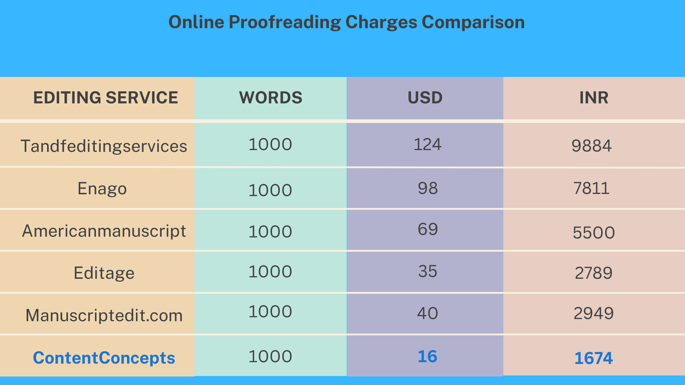

[Proofreading](https://contentconcepts.com/services/academic_editing/proofreading_service/) is like the secret ingredient that adds a touch of excellence and professionalism to your written content. If you're in India and on the hunt for proofreading services, you're probably curious about the cost. Fear not, for we're about to embark on a journey to unravel the factors that determine the cost of proofreading in India. Get ready to gain valuable insights and find out how much you should budget for this essential service.

## Proofreading Charges in India: Your Burning Questions Answered

### **1. How is the proofreading fee determined?**

The proofreading fee takes various factors into account. First and foremost, the word count of your document sets the stage. But hey, don't worry, figures, tables, and references usually don't make the cut. To get a spot-on quote, it's wise to remove any sections you don't want tinkered with before you hit that submit button. And remember, the level of editing you seek for your manuscript also dances in the spotlight. Different editing service providers offer different levels, from simple proofreading to more in-depth substantive editing.

### **2. What's the price range for proofreading in India?**

Here's the scoop: it can vary depending on the service provider and the level of editing you desire. On average, the cost per page or per word falls within a competitive range compared to other countries. But hey, don't take that for granted! It's your money we're talking about, so go ahead and do your homework. Compare prices and services offered by different providers to find that sweet spot where quality meets affordability.

### **3. How does the service provider's location impact the cost?**

Brace yourself, for it holds sway over the cost of proofreading. Places like the US, UK, and Europe tend to have heftier charges due to their fancy financial status and bloated economies. But guess what? India has become a haven for top-notch English editors with native-level language skills. That's right! We're talking about a talented pool of professionals who won't break your bank. So, fear not, fellow wordsmiths, affordable proofreading options abound without compromising on quality.

### **4. Can I expect high-quality proofreading services in India?**

Oh, absolutely! India is flexing its linguistic muscles, my friend. With an ever-growing number of English speakers and professionals, the country now boasts [native-level English editors ](https://contentconcepts.com/services/academic_editing/english_editing/)who are the crème de la crème of proofreading. These language virtuosos have honed their skills and acquired the expertise to meet international standards with finesse. Rest easy knowing you can find qualified professionals who'll sprinkle their magic dust and transform your content into a polished masterpiece, free from pesky errors.

### **Choose the Best and Trustworthy Proofreading Service**

When it comes to [proofreading in India](https://contentconcepts.in/services/academic_editing/proofreading_service/), costs may vary depending on word count, editing level, and the location of the service provider. But fret not, for we've got your back! It's crucial to opt for a reliable and experienced proofreading service that offers competitive pricing without skimping on quality. By investing in professional proofreading, you'll take your written content to new heights, leaving a lasting impression on your readers. So, what are you waiting for? Take that leap, perfect your work, and savor the incredible benefits that come with it. Your words deserve nothing less.