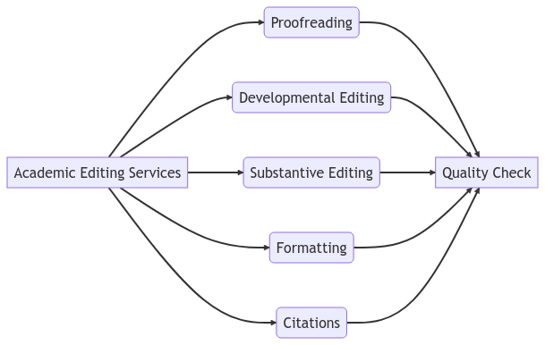

If you are looking for affordable yet top-quality academic manuscript editing services you have reached the right place. Our mission is to provide [manuscript editing](/services/academic_editing/manuscript_editing) and proofreading services at affordable price.

## **Top-Quality Academic Editing Services**

Our team of highly [experienced editors](https://contentconcepts.com/about/) are well-versed in a wide range of academic disciplines, ensuring that your work is polished, refined, and ready for publication.

## **Comprehensive Editing Services for Research Papers and Scholarly Articles**

From basic [proofreading service](https://contentconcepts.com/services/academic_editing/proofreading_service/) and grammar checks to more advanced editing services such as developmental and [substantive editing,](https://contentconcepts.com/services/academic_editing/scientific_manuscript_editing/) we offer comprehensive editing services for all your academic needs. Our editors have the expertise and knowledge to help you produce work that is both academically sound and highly polished.

## **Basic Proofreading and Grammar Checks for Academic Papers**

Don't let grammatical errors and typos distract your professor from your brilliant ideas. Our basic proofreading and grammar checks will ensure your paper is error-free and ready for submission.

## **Developmental Editing for Academic Papers**

Stuck on ideas or struggling with organization? Our developmental editing service will help you develop your ideas and structure your paper in a way that is coherent and compelling.

## **Substantive Editing for Academic Papers**

Need help with flow and readability? Our [substantive editing ](https://contentconcepts.com/services/academic_editing/manuscript_editing/)service will help you improve the overall quality and clarity of your writing.

## **Formatting and Citation Help for Academic Papers**

[Manuscript formatting](https://contentconcepts.com/services/business_editing/document_formatting/) and citation can be tricky, but our editors are experts at ensuring your work meets the strict academic standards and guidelines required for publication. 

## **Adhering to Academic Standards and Guidelines**

We understand the importance of adhering to strict academic standards and guidelines. That's why all of our editors have a thorough understanding of the academic publishing process, including the requirements for different types of academic papers, as well as the expectations of academic publishers and journal editors.

## **Thorough Understanding of the Academic Publishing Process**

Don't let the academic publishing process intimidate you. Our editors have a thorough understanding of the process and can guide you through each step with ease.

## **Expertise in Working with Non-Native English Speakers**

English not your first language? No problem. Our editors are highly skilled at working with non-native English speakers, ensuring that your work is not only grammatically correct but also written in clear, concise, and easily understandable language.

## **Taking Your Academic Work to the Next Level with Our Editing Services**

Whether you're a graduate student working on your thesis, a professor preparing a manuscript for publication, or a researcher submitting an article to a peer-reviewed journal, our editing services will help you take your work to the next level.

## **Wide Range of Editing Services for Graduate Students, Professors, and Researchers**

We offer a wide range of editing services tailored to meet the needs of graduate students, professors, and researchers. No matter what stage of the writing process you're in, we have the expertise and knowledge to help you produce high-quality work.