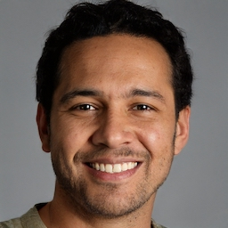
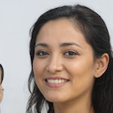
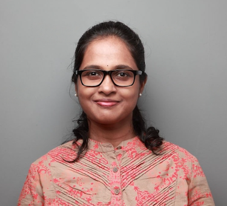

# **Manuscript Editors**

## **Ross Taylor**

Masterful English editing meets scientific precision. A linguist and engineer by training, Ross specializes in science, medical, and tech manuscripts. He also holds a TEFL certification, ensuring clarity for international authors.

**Dr. Carole J:** Medical & life sciences editing with world-class expertise. Carole's meticulous editorship is backed by research experience at Harvard, Columbia, and UNC. Trust her to elevate your manuscript to publication-ready perfection.

# **Scientific Editors**

### **Dr. Katharine Hughes**

 25+ years of academic editing prowess. From theses to dissertations, Dr. Katharine has polished over 20,000 pages across medical sciences, IT, and bioinformatics. ESL specialists welcome!

### **Dr. Ashraf**

Biostatistics PhD meets meticulous editor. Dr. Ashraf's 45+ research publications and years of academic experience translate into sharp editing for your medical papers and theses. Board-certified and detail-oriented, he'll ensure success.

### **Dr. Monika Mukherjee**

Pharmacology expert, editing ace. With 20+ years at a top pharma lab and a PhD in Pharmacology, Dr. Monika specializes in ESL editing for scientific manuscripts. Clear communication starts here.

# **Thesis Editors**

### **Dr. Athira**

Biotechnology PhD, meticulous thesis editor. Dr. Athira's 16 years of academic experience and 45+ publications equip her to provide detailed feedback and support. Trust her to help you navigate the path to successful publication.

### **Dr. Nalini Kannan**

Scientist turned editor, your thesis whisperer. Dr. Nalini's 20-year career at a leading Indian biotech lab honed her writing and editing skills across research proposals, regulatory documents, and clinical trials. She understands your journey and guides you to thesis excellence.

### **Alan Wichelman**

Flawless research writing, guaranteed. Native English editor Alan specializes in thesis editing, with expertise in APA, Chicago Manual, and more. He's edited over 100 theses, ensuring impeccable clarity and formatting.