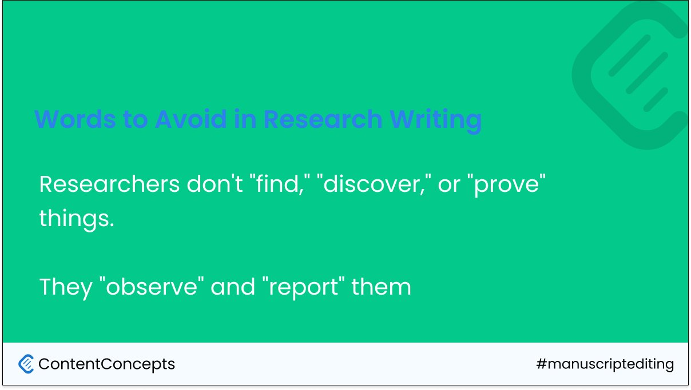
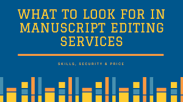

Whether you're writing your research paper or marketing document or your next best-selling novel, a [manuscript editor](https://contentconcepts.com/about/) is your secret weapon to success. We'll dive into the world of editing - from [proofreading](https://contentconcepts.com/services/academic_editing/proofreading_service) to line editing, and everything in between. And let's not forget the burning question: [how much will manuscript editing cost?](https://contentconcepts.com/blog/how-much-does-manuscript-editing-cost-per-page-per-word/) Don't worry, we've got you covered - without breaking the bank. So sit back, relax, and let's edit this masterpiece together!

Manuscript editing is like conducting a science experiment on your writing. We'll mix in the perfect balance of clarity, conciseness, and academic jargon to create a winning formula. With our trusted and affordable manuscript editing service, we'll help you reach your research goals faster. We'll tackle those grammar and punctuation errors, fine-tune the language and style, and make sure your work is top-notch. With our affordable and trusted manuscript editing service, your research paper will shine brighter than a diamond.

### What in the world does a manuscript editor actually do?

First things first, we start manuscript editing by diving deep into the nitty-gritty of your written work, analyzing every word and sentence with a fine-tooth comb. We're like the grammar police, on the lookout for pesky spelling mistakes, grammar errors, and syntax slip-ups.

Next, we'll work our magic to polish up the language, smoothing out any awkward phrasing or clunky sentences. We'll sprinkle in some extra pizzazz to make your work sing, enhancing the overall readability and flow.

But we don't stop there, oh no. We also take a big-picture approach, ensuring that your work is clear, concise, and consistent throughout. We'll make sure your ideas are presented in a logical and organized way, making it easier for your readers to follow along.

Finally, after hours of meticulous editing, we'll send your work back to you, shining like a diamond in the rough. And voila! You'll be left with a piece of writing that's so good, you'll want to frame it and hang it on your wall.

### Importance of manuscript editing

Manuscript editing is the secret sauce that transforms mediocre writing into a masterpiece. With a sprinkle of editing magic, you'll improve readability, enhance quality, and skyrocket your chances of getting published. Don't be just another submission lost in the slush pile, stand out with a well-edited manuscript and earn your place in the publishing hall of fame!"

### Types of editing

There are four main types of editing - proofreading, [copy editing](https://contentconcepts.in/services/business_editing/website_copy_editing), substantive editing, and developmental editing.

- **[Proofreading](https://contentconcepts.in/services/academic_editing/proofreading_service)** involves checking for grammatical, punctuation and spelling errors.

  **Copy editing** improves the overall language and flow of the text.

  **Substantive editing** focuses on the structure and content of the text.

  **Developmental editing** makes changes to the story, characters, and themes of a manuscript.

  Read more detail on the level of editing done for each type of editing.

### Steps in editing a manuscript

The first step in editing a manuscript is to look it over and identify what needs to be changed. This is followed by developmental editing, which involves making changes to the structure and content of the text. English language editing concerns improving the flow of language and overall focus of the work. Proofreading involves checking for grammatical, punctuation, and spelling errors.

### Difference between proofreading and manuscript editing

[Proofreading vs Substantive Editing](https://contentconcepts.in/blog/manuscript-editing-services-for-research-papers-proofreading-copy-editing-substantive-editing-which-editing-level-should-i-select/) - proofreading is a type of editing that focuses on correcting errors in spelling, grammar, and punctuation. Manuscript editing, on the other hand, involves making changes to the content, structure, and style of the text to improve its overall quality. Proofreading is a crucial aspect of manuscript editing, but it should not be considered the only step in the editing process.

### How much does manuscript editing cost?

The [cost of manuscript editing services](https://contentconcepts.in/blog/how-much-does-manuscript-editing-cost-per-page-per-word/) varies depending on the type of editing required and the length of the manuscript. Developmental editing can be more expensive than proofreading. However, there are also affordable manuscript editing services available that offer quality services at a reasonable cost.

### Who can edit my manuscript?

[Manuscript editors](https://contentconcepts.in/about/) are professional editors who specialize in editing manuscripts. Native English editors are particularly sought after as they can provide an extra level of editing to ensure that the text is of the highest quality. You can find manuscript editors near you through online searches or by asking for recommendations from other writers.

### Should you Pay for an editor for your manuscript?

Hiring an editor for your manuscript has many benefits, including improving the quality of your writing, increasing your chances of getting published, and saving you time and effort. However, there are also factors to consider when deciding whether to pay for an editor, including the cost and the type of editing required.

Check our other related editing services:
