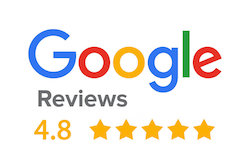

[Proofreading](https://contentconcepts.com/blog/proofreading-services-in-india-why-they-are-the-best-choice/) is like having a second set of eyes on your work - except this time, they're sober. Without it, your writing can look like it was done by a sleep-deprived monkey banging on a keyboard. So, let's avoid embarrassing mistakes like “let’s eat grandma” instead of “let’s eat, grandma.”

At **[Content Concepts](https://contentconcepts.in/about/)**, we understand that well-written content is the key to success in any field. Our team of experienced and native English proofreaders is committed to ensuring that your document is error-free and polished to perfection. We offer quick turnaround times and [affordable proofreading](https://contentconcepts.com/pricing/#pricing) costs to meet your needs.

## **Our Proofreading Services**

We offer a range of [proofreading services](https://contentconcepts.com/services/academic_editing/proofreading_service) to suit your needs. Our **[proofreading service](https://contentconcepts.in/services/academic_editing/proofreading_service)** is perfect for academic documents, while our **[English editing service](https://contentconcepts.in/services/business_editing/english_editing_india)** is ideal for businesses looking to improve their written communication. Our services include:

- Manuscript proofreading
- Thesis proofreading
- Website proofreading
- Document proofreading
- Technical proofreading
- Business proofreading
- scientific proofreading
- Legal proofreading
- Medical proofreading

## **Why Choose ContentConcepts**

At [ContentConcepts](https://contentconcepts.com/), we are committed to providing our clients with the highest level of service. Our team of native English proofreaders are experts in their field and will ensure that your document is polished to perfection. We offer affordable [proofreading service rates](https://contentconcepts.com/blog/how-much-does-manuscript-editing-cost-per-page-per-word/) and quick turnaround times to meet your needs. We are also unique in that we offer a [free editing certificate](https://contentconcepts.com/blog/free-english-editing-certificate/) with our proofreading services, ensuring that you can submit your document with confidence.

## Rated Best and Trusted P**roofreading Service** by Customers

ContentConcepts has earned a reputation for excellence in providing [the best proofreading and editing services](https://contentconcepts.com/blog/contentconcepts-top-rated-academic-editing-and-proofreading-services/). Our native English proofreaders are industry experts who provide affordable services for clients with academic and business proofreading needs. In addition, we offer a free editing certificate with our proofreading services, and we'll proofread the first 200 words of your document for free (if your document is more than 10k words).

## **Frequently Asked Questions**

**1. What is proofreading?**

Proofreading is the process of checking a written document for errors in spelling, grammar, punctuation, and syntax.

**2.Who proofreads your document?**

Our proofreaders have several years of experience in proofreading your subject, are certified by international boards and are bound by our confidentiality agreements to protect customer data.

**3.What is the proofreading price or cost per page per word?**

Our proofreading service rates vary depending on the level of service required. Please visit our **[pricing page](https://contentconcepts.in/pricing/#pricing)** for more information.

**4.What is the best and most affordable proofreading service?**

Content Concepts offers affordable proofreading service rates and quick turnaround times to meet your needs. Contact us today to learn more. Check here to compare the top editing services and their [proofreading rates](https://contentconcepts.com/blog/how-much-does-manuscript-editing-cost-per-page-per-word/)

**5.How to select an online proofreading service?**

When selecting an online proofreading service, it is important to choose a provider with a team of experienced and native English proofreaders. It is also important to consider the provider's turnaround time and proofreading costs. Read [How to select a trusted and best online proofreading service?](https://contentconcepts.com/blog/10-key-features-of-top-manuscript-editing-proofreading-services/)

**6.What to expect from a proofreading service?**

At Content Concepts, you can expect a thorough and professional proofreading service that ensures your document is error-free and polished to perfection.

**7.Do you provide a free English editing** **certificate?**

Yes, we offer a [free editing certificate](https://contentconcepts.com/blog/free-english-editing-certificate/) with our proofreading services. Check our freed editing certificate sample

**8.Do you provide a free proofreading service?**

We offer [proofreading service for free](https://contentconcepts.com/blog/free-editing-proofreading-on-first-200-words/) and [manuscript editing service for free ](https://contentconcepts.com/blog/free-editing-proofreading-on-first-200-words/)for first-time customers for limited word count. Write to us if you want free proofreading.

### Check our other related editing services
