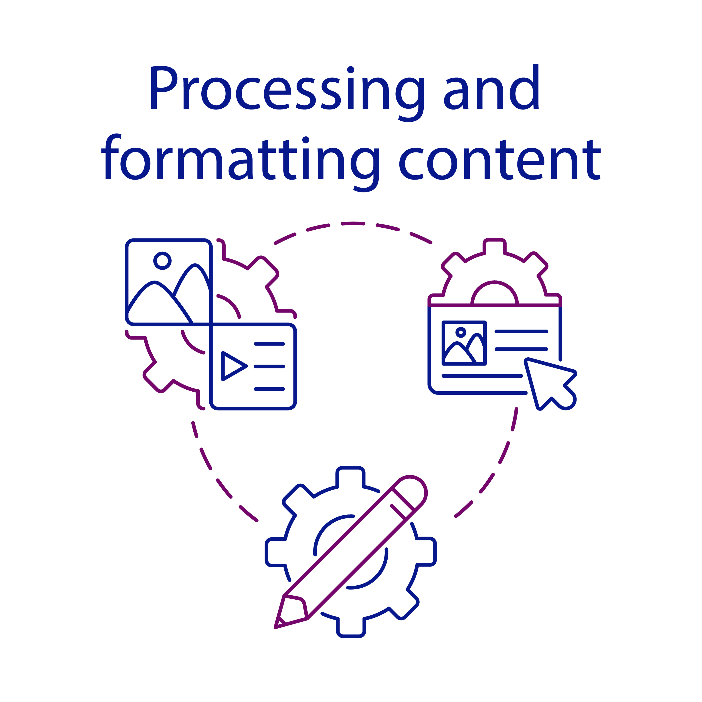

<b>**Are you tired of spending hours meticulously formatting your documents, only to end up with inconsistent styles and formatting errors? Look no further! Our Document Formatting Service is here to save you time, effort, and frustration**.</b>

We format documents, such as reports, essays, theses, research papers, business proposals, legal documents, academic manuscripts, marketing materials, presentations, newsletters, and any other type of document you may need.

## **Transforming Chaos into Elegance**

We understand that document formatting can be a tedious and time-consuming task. Whether you're preparing a business report, a research paper, a thesis, or any other document, ensuring a consistent and professional appearance is essential. Our team of experts is well-versed in the art of transforming chaotic documents into polished, elegant masterpieces.

## **Why Choose Our Document Formatting Service?**

### **1. Professional Expertise**

Our experienced team consists of formatting wizards who possess a keen eye for detail. They are well-versed in various formatting styles, including APA, MLA, Chicago, Harvard, and more. No matter the complexity or specificity of your formatting requirements, we have the knowledge and expertise to deliver outstanding results.

### **2. Consistency and Accuracy**

Consistency is key when it comes to document formatting. Our experts pay meticulous attention to every detail, ensuring that fonts, headings, margins, spacing, and other elements are consistent throughout your document. Say goodbye to the frustration of mismatched styles and formatting inconsistencies.

### **3. Time and Effort Savings**

Why spend hours wrestling with formatting issues when you can leave it to the professionals? By outsourcing your document formatting to us, you free up valuable time and energy that can be better utilized for other important tasks. Focus on your content and let us handle the formatting for you.

### **4. Customized Solutions**

Every document has its unique formatting requirements, and we understand that. Whether you need a specific formatting style implemented or have special instructions for your document, our team is flexible and adaptable. We work closely with you to understand your needs and provide customized solutions tailored to your preferences.

## **Our Document Formatting Process**

1. **Consultation**: We begin by discussing your document formatting requirements. We take the time to understand your preferences, specific guidelines, and any special instructions you may have.
2. **Formatting Analysis**: Our experts thoroughly analyze your document to identify any existing formatting issues or inconsistencies. This step helps us determine the level of work required and develop an effective formatting strategy.
3. **Formatting Execution**: Armed with the knowledge gathered from the previous steps, our team sets out to work their magic. They meticulously format your document, ensuring that every element aligns with the desired style.
4. **Quality Assurance**: We understand the importance of delivering error-free documents. Our quality assurance team conducts a thorough review to double-check the formatting accuracy, consistency, and adherence to your requirements.
5. **Delivery**: Once our experts are satisfied with the formatting and quality checks, we deliver the beautifully formatted document to you within the agreed-upon timeframe.