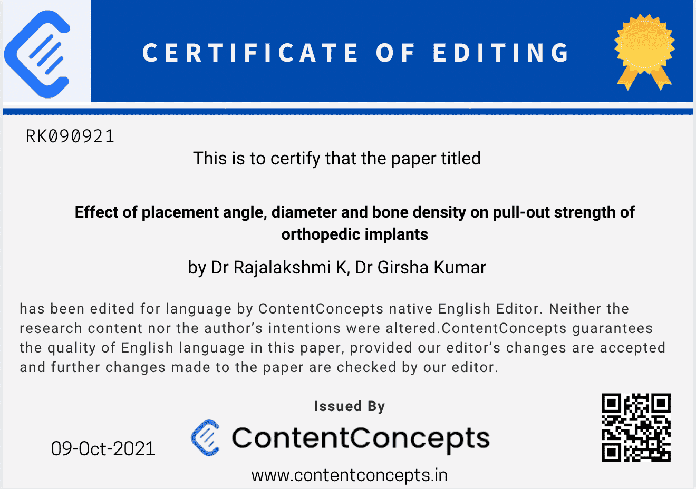

## What is  English Editing Certificate?

Our [English Editing Certificate](https://contentconcepts.com/blog/english-language-editing-certificate-for-manuscript-authors/) is proof that a skilled [English language edito](https://blog.contentconcepts.com/our-manuscript-editorsscientific-editors-proofreaders)r from ContentConcepts has thoroughly reviewed and refined your academic work. We proudly provide this certificate for download, offering tangible evidence of language accuracy and ensuring your document is ready for submission. We guarantee papers free from language errors, solidifying our reputation as a trusted name in academic editing and proofreading.

